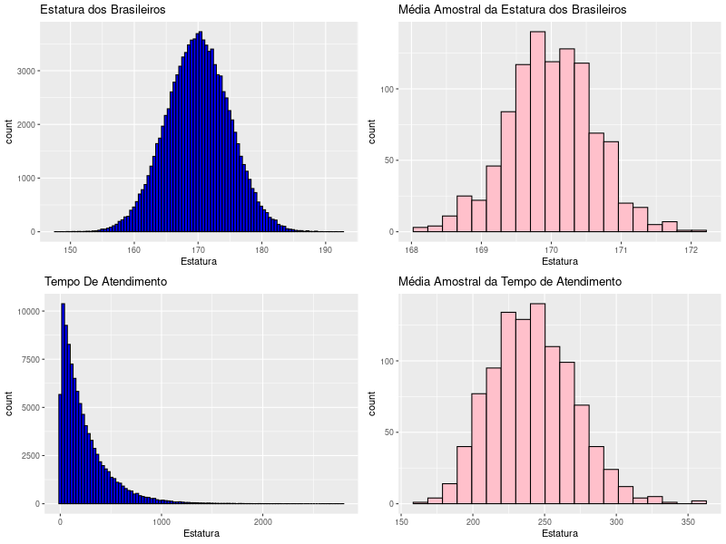

  

 

O [Teorema do Limite Central](https://pt.wikipedia.org/wiki/Teorema_central_do_limite) é um dos pilares fundamentais da estatística e tem um papel crucial na inferência estatística. Ele estabelece que, à medida que o tamanho de uma amostra aleatória aumenta, a distribuição das médias amostrais se aproxima cada vez mais de uma distribuição normal, independentemente da forma da distribuição da variável aleatória subjacente.

  

Em outras palavras, mesmo que a variável aleatória original não seja normalmente distribuída, a distribuição das médias de várias amostras será aproximadamente normal. Esse resultado é extremamente útil, pois permite que a média da amostra seja utilizada como estimativa da média populacional, proporcionando mais confiança nas inferências estatísticas.

Para testar essa poderosa propriedade, podemos usar o software R para realizar um experimento simples. Primeiro, geramos uma distribuição normal e outra exponencial. Em seguida, extraímos 1000 amostras de tamanho "n" (sendo "n" maior que 30) de cada distribuição e registramos a média de cada amostra.

Ao plotar os histogramas das médias amostrais para ambas as distribuições, observaremos que, mesmo a distribuição original sendo exponencial, os histogramas se aproximam de uma distribuição normal à medida que aumentamos o tamanho das amostras. Como podemos ver pelo gráfico gerado pela simulação realizada em [Simulando_TLC.R](https://github.com/Leiliane-Oliveira/Analise-de-Dados-com-Linguagem-R/blob/main/Inferencia_Estatistica/TLC/Simulando_TLC.R).

  

  
Curiosamente, muitas características populacionais têm distribuição normal, como a altura das pessoas, o que nos permite fazer previsões mais precisas sobre essa característica em uma população. Outro evento real que segue uma distribuição exponencial é o tempo de atendimento em um call center. A compreensão dessa distribuição é valiosa para planejar a capacidade de atendimento e melhorar a eficiência dos serviços prestados.
  

Em resumo, o Teorema do Limite Central é uma ferramenta poderosa e amplamente utilizada na estatística, garantindo que a média amostral seja uma estimativa confiável da média populacional, independentemente da distribuição da variável original. Isso nos permite entender e prever melhor uma ampla variedade de fenômenos na vida real, desde características populacionais até tempos de espera em filas de atendimento.  

> **FISCHER**, H. <i>A History of the Central Limit Theorem</i>. [S.l.]: Springer, 2011.  > **MONTGOMERT**, DC; RUNGER, GC. <i>Estatística aplicada e probabilidade para engenheiros</i>. Rio de Janeiro: LTC Editora, 2014 (5ª Edição).
