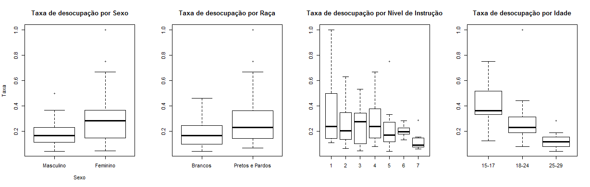
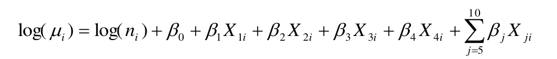

# Análise de Dados com Linguagem R

  

 

-   [1. Descrição](#1-descrição)
-   [2. Organização do Diretório](#2-organização-do-diretório)
-   [3. Referências](#3-referências)

# 1. Descrição

Esta análises tem como objetivo verificar as disparidades da taxa de desocupação dos jovens, de 15 a 29 anos de idade, do estado de Minas Gerais. Para isso usamos os dados da Pesquisa Nacional por Amostra de Domicílios Contínua [(PNAD Contínua)](https://www.ibge.gov.br/estatisticas/sociais/trabalho/17270-pnad-continua.html), da edição do terceiro trimestre de 2016, do Instituto Brasileiro de Estatística e Geografia [(IBGE)](https://www.ibge.gov.br/pt/inicio.html). **Através de modelagem de Poisson, investigamos os efeitos do sexo, raça, faixa etária e nível de instrução, na variação da taxa de desocupação dada por tais características sociodemográficas**. As análises foram realizadas, no software livre R na versão 3.3.2[^1]. Pelo modelo ajustado, concluímos existir diferenças por sexo, raça, faixa etária e nível de instrução nas taxas de desocupação, sendo a taxa de desocupação maior, em média, para as mulheres, para os pretos e pardos, para os jovens de 15 a 17 anos, e para níveis de
instrução mais inferiores. Pela Figura 1.1, podemos observar a distribuição da taxa de desocupação por sexo, raça, nível de instrução e idade.

[^1]: Inicialmente foi realizado o tratamento inicial dos dados no software SPSS. E os dados originais da PNAD Contínua usados nesta etapa você encontra [aqui](https://drive.google.com/file/d/1vwxtTRCr7YNWNrK1JDOyA_GhJ9Nqw5ip/view?usp=sharing).

  

<i>Figura 1.1. Taxa de Desocupação dos Jovens (15-29) de Minas Gerais, segundo Sexo, Raça, Nível de Instrução e Idade – 3º Trimestre de 2016. 
As categorias de Nível de Instrução são: 1-Sem instrução, 2-Fundamental incompleto ou equivalente - Fundamentalcompleto ou equivalente, 4-Médio incompleto ou equivalente, 5-Médio completo ou equivalente, 6-Superior incompleto ou equivalente, 7-Superior completo ou equivalente.</i>

Como estratégia de modelagem, iniciamos ajustando o modelo nulo, depois apenas o offset,e em seguida inserindo uma variável explicativa de cada vez, em seguida acrescentamos asinterações possíveis, sempre verificando a significância do(s) termo(s) inserido(s). Foram ajustados 21 modelos, com o intuito de verificar os apontamentos da literatura bem como verificar se existe efeito de interação entre as características sociodemográficas dos jovens na taxa de desocupação.

Assumimos o nível de significância de 5% em nossas análises. A avaliação da qualidade do modelo se deu pelas estatísticas: Deviance (D), Qui-quadrado de Pearson (X²) e pelo Critério de Informação de Akaike (AIC), conforme indicado por Dobson (2002). Comparações entre modelos foram realizadas pelo teste de diferença de Deviance, para aqueles modelos validados pelo teste da Deviance.

O modelo com melhor ajuste foi formalizado conforme Figura 1.2:

  

<i>Figura 1.2. Formalização do modelo com melhor ajuste.</i>

onde X1 é a variável sexo, sendo 0= masculino e 1= feminino; X2 é a variável raça, sendo 0= Brancos
e 1=Pretos e Pardos; X3= variável faixa etária, sendo 1=18 a 24 anos e 0=caso contrário, X4= variável faixa etária, sendo 1=25 a 29 anos e 0=caso contrário, e Xj a variável dummy de nível de instrução, sendo j=5=Fundamental incompleto ou equivalente, j=6=Fundamental completo ou equivalente, j=7=Médio incompleto ou equivalente, j=8=Médio completo ou equivalente, j=9=Superior
incompleto ou equivalente e j=10=Superior completo ou equivalente. **Assim, a baseline do modelo
é, sexo masculino, faixa etária de 15 a 17 anos, jovens brancos e sem instrução.**

> No arquivo [MLG_LEILIANE_OLIVEIRA.pdf](https://github.com/Leiliane-Oliveira/Analise-de-Dados-com-Linguagem-R/blob/main/Modelos_Lineares_Generalizados/Poisson_Disparidades_Jovens/MLG_LEILIANE_OLIVEIRA.pdf) neste repositório você encontra mais detalhes dos ajustes dos 21 modelos.

> Essa análise teve um resumo espandido publicado no no International Union for the Scientific Study of Population [IUSSP](https://iussp.org/en/cape-town-2017) em 2 de nov de 2017 e pode ser encontrado [aqui](https://github.com/Leiliane-Oliveira/Analise-de-Dados-com-Linguagem-R/blob/main/Modelos_Lineares_Generalizados/Poisson_Disparidades_Jovens/IUSSP_LEILIANE_OLIVEIRA.pdf).

# 2. Organização do Diretório

Neste diretório os arquivos estão organizados da seguinte forma:

:file_folder: [Resultados](https://github.com/Leiliane-Oliveira/Analise-de-Dados-com-Linguagem-R/tree/main/Modelos_Lineares_Generalizados/Poisson_Disparidades_Jovens/Resultados) : Pasta com os resultados, tabelas e gráficos gerados nesta análise

:page_facing_up: [Taxa_de_desocupacao_Jovens_15_29_MG.csv](https://github.com/Leiliane-Oliveira/Analise-de-Dados-com-Linguagem-R/blob/main/Modelos_Lineares_Generalizados/Poisson_Disparidades_Jovens/Taxa_de_desocupacao_Jovens_15_29_MG.csv): Dados tratados da análise

:page_facing_up: [IUSSP_LEILIANE_OLIVEIRA.pdf](https://github.com/Leiliane-Oliveira/Analise-de-Dados-com-Linguagem-R/blob/main/Modelos_Lineares_Generalizados/Poisson_Disparidades_Jovens/IUSSP_LEILIANE_OLIVEIRA.pdf): Resumo estendido publicado no International Union for the Scientific Study of Population [IUSSP](https://iussp.org/en/cape-town-2017) em 2 de nov de 2017.

:page_facing_up: [MLG_LEILIANE_OLIVEIRA.pdf](https://github.com/Leiliane-Oliveira/Analise-de-Dados-com-Linguagem-R/blob/main/Modelos_Lineares_Generalizados/Poisson_Disparidades_Jovens/MLG_LEILIANE_OLIVEIRA.pdf): Artigo elaborado para a disciplina de Modelos Lineares Generalizados contendo os resultados desta análise

:page_facing_up: [Tratamento_dos_dados.sps](https://github.com/Leiliane-Oliveira/Analise-de-Dados-com-Linguagem-R/blob/main/Modelos_Lineares_Generalizados/Poisson_Disparidades_Jovens/Tratamento_dos_dados.sps): Script em SPSS dos tratamentos iniciais dos dados

:page_facing_up: [MLG_TX_Desocupacao.r](https://github.com/Leiliane-Oliveira/Analise-de-Dados-com-Linguagem-R/blob/main/Modelos_Lineares_Generalizados/Poisson_Disparidades_Jovens/MLG_TX_Desocupacao.R): Script da análise em R

:page_facing_up: [OutputR_MLG.html](https://github.com/Leiliane-Oliveira/Analise-de-Dados-com-Linguagem-R/blob/main/Modelos_Lineares_Generalizados/Poisson_Disparidades_Jovens/OutputR_MLG.html): Output do R

# 3. Referências

**ALVES**, J. E. D. <i>A transição demográfica e a janela de oportunidade</i>. São Paulo: Instituto Fernand Braudel de Economia Mundial; 2008. Disponível [aqui](http://www.braudel.org.br/pesquisas/pdf/transicao_demografica.pdf). Acessado em 17 de Nov.de 2016.

**CAMARANO**, A. A; **MELLO**, J. L.; **KANSO**, S. <i>Do nascimento à morte: principais transições</i>. In: **CAMARANO**, A. A. (Org.). <i>Transição para a vida adulta ou vida adulta em transição?</i> Rio de Janeiro: IPEA, 2006. Disponível [aqui](http://www.ipea.gov.br/portal/images/stories/PDFs/livros/capitulo_2_nascimento.pdf). Acessado em 17 de Nov. de 2016.

**DOBSON**, A. J. <i>An Introduction to Generalized Linear Models</i>. 2º Ed. Whashington: Chapman & hall/CRC, 2002.

**INSTITUTO BRASILEIRO DE GEOGRAFIA E ESTATÍSTICA (IBGE)**. <i>Pesquisa Nacional por Amostra de Domicílios Contínua. Notas Metodológicas</i>. Rio de Janeiro: IBGE, v.1, 2014. Disponível [aqui](http://ftp.ibge.gov.br/Trabalho_e_Rendimento/Pesquisa_Nacional_por_Amostra_de_Domicilios_continua/Notas_metodologicas/notas_metodologicas.pdf). Acessado em 15 de Out. de 2016.

**INSTITUTO BRASILEIRO DE GEOGRAFIA E ESTATÍSTICA (IBGE)**. . <i>Pesquisa Nacional por Amostra de Domicílios Contínua. Indicadores IBGE </i>– Agosto/2016. Rio de Janeiro: IBGE, 2016. Disponível [aqui](http://ftp.ibge.gov.br/Trabalho_e_Rendimento/Pesquisa_Nacional_por_Amostra_de_Domicilios_Continua/Trimestral/Fasciculos_Indicadores_IBGE/PNADc_201602_trimestre_caderno.pdf).Acesso em 13 de Out. de 2016.

**ORGANIZAÇÃO INTERNACIONAL DO TRABALHO (OIT)**. <i>Trabalho Decente e Juventude no Brasil.</i> Brasília: OIT, 2009. Disponível [aqui](http://www.ilo.org/wcmsp5/groups/public/---americas/---ro-lima/---ilo-brasilia/documents/publication/wcms_230674.pdf) Acessado em 17 de Nov. de 2016.
