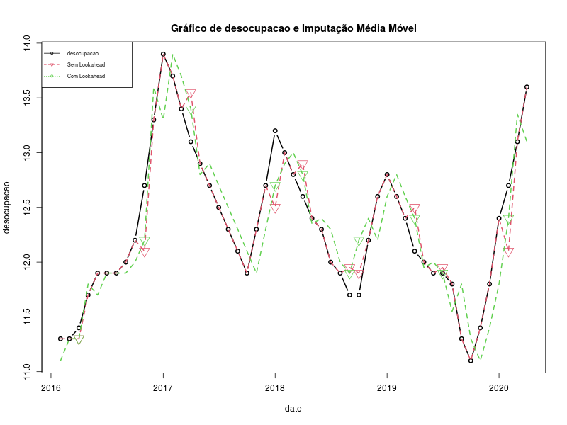

# Análise de Dados com Linguagem R

  

 

-   [1. Introdução](#1-introdução)
-   [2. Objetivo](#2-objetivo)
-   [3. Métodos de Imputação](#3-métodos-de-imputação)
    -   [3.1. Forward fill e Backward fill](#31-forward-fill-e-backward-fill)
    -   [3.2. Média Móvel](#32-média-móvel)
    -   [3.3. Interpolação Linear e Polinomial](#33-interpolação-linear-e-polinomial)
-   [4. Referências](#4-referências)

# 1. Introdução

Uma série temporal é uma sequência de dados observados ao longo do tempo, onde cada observação é registrada em um ponto específico no tempo. Essas observações podem ser coletadas em intervalos regulares (por exemplo, a cada hora, dia, mês) ou irregulares, dependendo do contexto e do problema em questão.

Dados ausentes em séries temporais são valores que estão faltando em algumas das observações ao longo do tempo. Esses valores podem ocorrer por diversas razões, como falhas de sensores, problemas no registro dos dados ou até mesmo mudanças na estrutura dos dados. A presença de dados ausentes pode prejudicar a análise e a modelagem de séries temporais, uma vez que a continuidade dos dados é essencial para compreender os padrões temporais.

O tratamento de dados ausentes em séries temporais é uma tarefa importante, e existem várias abordagens comumente utilizadas. A exclusão de linhas é a maneira mais simples de lidar com dados ausentes e é bem utilizada. No entanto, essa abordagem pode levar à perda significativa de informações, especialmente se houver muitos dados ausentes. Em séries temporais essa técnica é completamente inapropriada pois os dados devem estar igualmente espaçados no tempo e ao excluir as linhas com dados ausentes perde-se essa propriedade das séries temporais. Se os dados ausentes estiverem concentrados em um determinado período, até pode-se excluir todo o período (inclusive linhas com dados), no entanto, isso resultará em menos dados para os modelos de previsão. Decidir pela preservação ou exclusão de períodos de tempo é uma decisão que depende de cada caso e de cada tipo de uso da sua análise e/ou modelagem.

Neste projeto serão apresentadas algumas técnicas mais apropriadas para tratamento de dados ausentes em séries temporais, como imputação e interpolação.

# 2. Objetivo

Apresentar, com prática em R, algumas técnicas de imputação de dados para séries temporais.

Para a análise prática será utilizada a série histórica da taxa de desocupação brasileira do Instituto Brasileiro de Geografia e Estatística (IBGE) que pode ser encontrada na [página do instituto](https://www.ibge.gov.br/estatisticas/sociais/trabalho/9173-pesquisa-nacional-por-amostra-de-domicilios-continua-trimestral.html?=&t=series-historicas&utm_source=landing&utm_medium=explica&utm_campaign=desemprego), ou baixado pelo [csv]() deste repositório. O código em R pode ser consultado [aqui]().

Utilizamos as bibliotecas [data.table](https://cran.r-project.org/web/packages/data.table/index.html) e [zoo](https://cran.r-project.org/web/packages/zoo/index.html) do R. O pacote "zoo" oferece uma implementação do sistema de classes S3 para representar séries temporais. Isso permite que os usuários armazenem, processem e visualizem séries temporais de forma eficiente e eficaz. Além disso, a biblioteca suporta uma ampla variedade de operações em séries temporais, incluindo alinhamento de dados, interpolação, agregação, cálculo de médias móveis e preenchimento de valores ausentes. Já o pacote "data.table" é uma poderosa extensão da classe "data.frame" que oferece uma manipulação de dados mais eficiente e rápida, tornando-o uma excelente escolha para trabalhar com grandes conjuntos de dados em R. Ele é amplamente utilizado em projetos de análise de dados, ciência de dados e análise estatística devido à sua eficiência e desempenho.

# 3. Métodos de Imputação

A imputação é uma técnica útil para estimar valores ausentes em séries temporais, e a escolha do método adequado dependerá das características dos dados, da complexidade dos padrões temporais e das necessidades específicas da análise. É importante lembrar que, embora a imputação possa ser útil para preencher valores ausentes, ela não deve ser aplicada indiscriminadamente, pois pode introduzir distorções ou não ser apropriada para todos os casos.

Cabe aqui uma ressalva muito importante: <strong>CUIDADO COM O LOOKAHEAD!!!</strong>

<blockquote style="background-color: salmon; padding: 10px; color: black;">
Em análise de séries temporais, um <strong>Lookahead</strong> é um conceito usado para se referir a qualquer conhecimento do futuro antes que ela aconteça. No caso de imputação é utilizar informações futuras para estimar o dado ausente do passado. Um lookahead pode se propagar ao longo do tempo em sua análise/modelagem e impactar como seu modelo se comporta temporalmente.
</blockquote>

## 3.1. Forward fill e Backward fill

Na técnica **Forward fill** (preenchimento por valores anteriores), os valores ausentes são preenchidos com o último valor conhecido anteriormente no tempo. Isso é adequado quando os dados ausentes não ocorrem em sequência prolongada.

Na técnica **Backward fill**(preenchimento por valores seguintes), similar ao forward fill, mas os valores ausentes são preenchidos com o próximo valor conhecido no tempo. Mas **CUIDADO** como trata-se de um caso de **LOOKAHEAD**, essa técnica só deve ser usada quando não tiver o objetivo de prever o futuro.

Em nossa prática, geramos um gráfico para compararmos os valores imputados por essas duas técnicas. Como você pode observar na Figura 3.1, os valores preenchidos normalmente não diferem muito dos valores reais. No entanto, cada técnica gera seus próprios valores de imputação que podem ser distintos.

  

<i>Figura 3.1. Série original plotada com uma linha sólida (linha preta) e as séries temporais com os valores ausentes preenchidos pelos métodos forward fill (linha vermelha) e backward fill (linha verde).</i>

## 3.2. Média Móvel

A imputação por média (ou mediana) móvel é uma abordagem que estima os valores ausentes usando uma média (ou mediana) dos valores conhecidos próximos no tempo. Essa técnica é útil para suavizar flutuações e reduzir o ruído nos dados. A imputação por média móvel utiliza uma janela de tamanho definido, que desliza sobre a série temporal. Em cada posição, a média dos valores dentro da janela é calculada e atribuída ao ponto desconhecido.

A imputação por média móvel é especialmente útil quando a série temporal possui uma sazonalidade bem definida ou ruído significativo. Entretanto, essa abordagem pode causar atrasos nas previsões, pois o valor estimado sempre dependerá dos valores conhecidos dentro da janela. Além disso, ela reduz a variânica no conjunto de dados, ou seja, ao calcular medidas de acurácia dos modelos você pode estar superestimando seu desempenho.

Essa técnica pode causar um **LOOKAHEAD** se nos dados da janela de cálculo da média estiverem dados do passado e do futuro, ou seja, se o dado faltante estiver no centro desta janela de cálculo. Para evitar o lookahead é indicado usar apenas valores do passado na janela móvel de cálculo.

Em nossa prática, geramos um gráfico para compararmos os valores imputados por média móvel com e se lookahead. Como você pode observar na Figura 3.2, os valores preenchidos normalmente não diferem muito dos valores reais. No entanto, cada técnica gera seus próprios valores de imputação que podem ser distintos.

  

<i>Figura 3.2. Série original plotada com uma linha sólida (linha preta) e as séries temporais com os valores ausentes preenchidos pelo método de média móvel sem lookahead (linha vermelha) e com lookahead(linha verde).</i>

## 3.3. Interpolação Linear e Polinomial

A interpolação linear é uma técnica simples que estima os valores ausentes usando uma linha reta para conectar os pontos conhecidos adjacentes no tempo. Suponha que temos uma série temporal com pontos conhecidos em t1, t2 e t3, e queremos estimar o valor em um ponto desconhecido t. A interpolação linear considera a reta que passa pelos pontos (t1, y1) e (t3, y3) e estima o valor de y no ponto t. Essa abordagem é adequada quando a série temporal apresenta uma mudança gradual entre os pontos conhecidos, mas pode não ser a melhor escolha quando há flutuações mais complexas nos dados.

A interpolação polinomial é uma técnica mais flexível que utiliza polinômios para conectar os pontos conhecidos. Em vez de usar uma linha reta como na interpolação linear, a interpolação polinomial pode ajustar curvas mais complexas aos dados conhecidos. Nesse método, o grau do polinômio usado é determinado pela quantidade de pontos conhecidos e pela complexidade dos padrões temporais.

Existem várias formas de interpolação polinomial, como interpolação de Lagrange e interpolação de Newton. Essas abordagens envolvem a construção de um polinômio que passe por todos os pontos conhecidos, e a estimativa do valor nos pontos desconhecidos é obtida substituindo o valor de t no polinômio interpolador.

Embora a interpolação polinomial seja mais flexível do que a interpolação linear, ela pode levar a oscilações indesejadas nos dados se o grau do polinômio for muito alto, o que é conhecido como "fenômeno de Runge". Portanto, a escolha do grau do polinômio é um compromisso entre a precisão da interpolação e a simplicidade do modelo.

A interpolação pode ser feita de forma a considerar os dados passados e futuros, ou apenas uma direção. Permita o lookahead apenas se tiver certeza de que não representa um problema para a sua análise, conforme discutimos antes, em casos de previsão não é recomendado um lookahead.

Em nossa prática, geramos um gráfico para compararmos os valores imputados por interpolação linear e polinomial, ambos com lookahead. Como você pode observar na Figura 3.3, os valores preenchidos normalmente não diferem muito dos valores reais. No entanto, cada técnica gera seus próprios valores de imputação que podem ser distintos.

  

<i>Figura 3.3. Série original plotada com uma linha sólida (linha preta) e as séries temporais com os valores ausentes preenchidos pelo método de interpolação linear (linha vermelha) e interpolação polinomial (linha verde).</i>

# 4. Referências

**MORETTIN**, P.A.; **TOLOI**, C.M. <i>Análise de Séries Temporais</i>. 2.ed. São Paulo: Edgard Blucher, 2006.

**NIELSEN**, Aileen. <i>Análise Prática de Séries Temporais: Predição com estatística e aprendizado de máquina</i>. Traduzido por Cibelle Ravaglia. Rio de Janeiro: Alta Books, 2021. [https://github.com/PracticalTimeSeriesAnalysis/BookRepo/tree/master](https://github.com/PracticalTimeSeriesAnalysis/BookRepo/tree/master)
